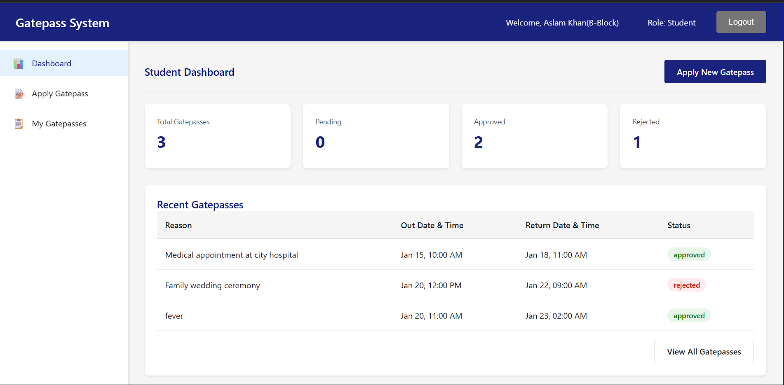
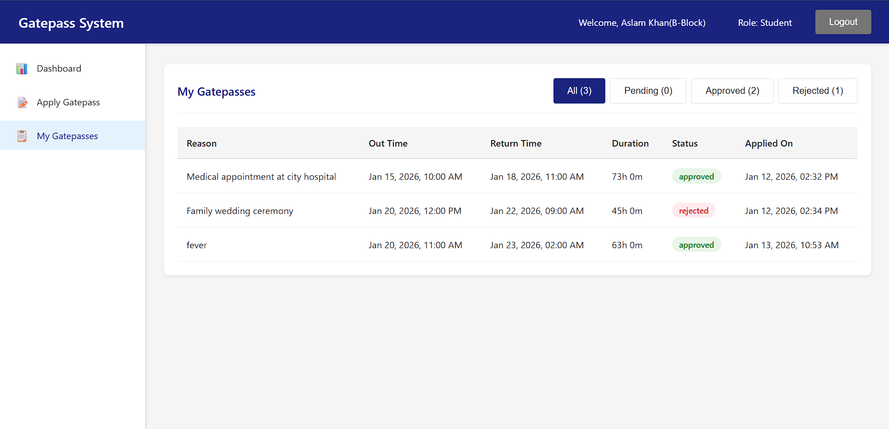
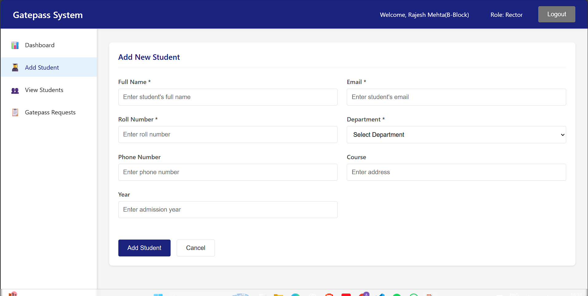
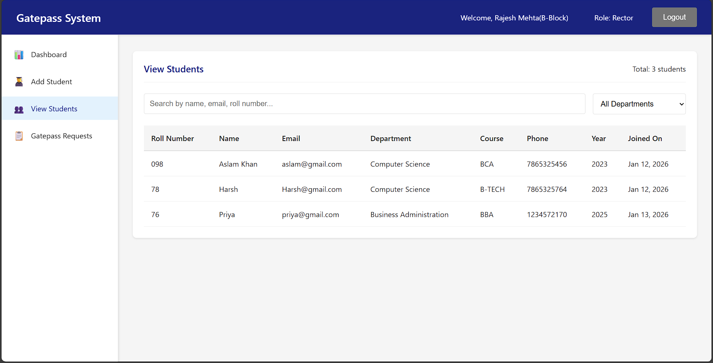
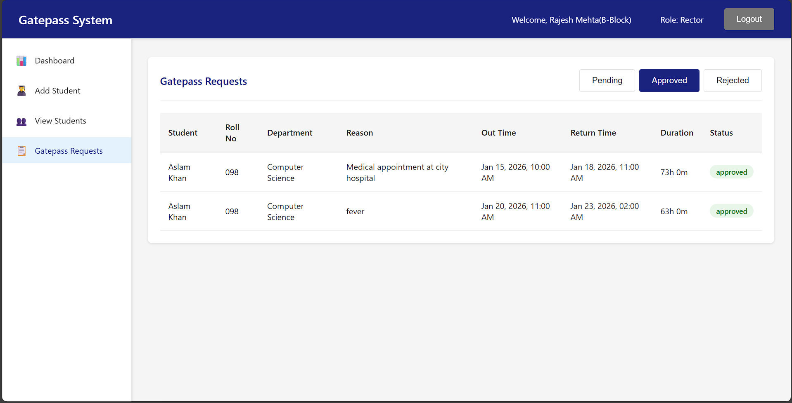

# 🏫 Online Gatepass Approval System (MERN Stack)

An **Online Gatepass Approval System** built using the **MERN Stack** that allows students to apply for gatepasses digitally and rectors to approve or reject requests based on **hostel-wise access**.

This system eliminates paperwork and provides a **secure, role-based, real-time approval workflow**.

---

## 🚀 Features

### 👨‍🎓 Student Panel
- Secure student login (JWT-based authentication)
- Apply for gatepass online
- View gatepass status (Pending / Approved / Rejected)
- View gatepass history
- Restriction: Cannot apply for a new gatepass if one is already pending
- Responsive UI for mobile and desktop

### 👨‍💼 Rector Panel (Hostel-Based)
- Secure rector login
- **Multiple rectors supported**
- Each rector is assigned a specific **hostel**
- Rector can:
  - View only gatepasses of students from their hostel
  - Approve or reject gatepass requests
  - See student details while approving (name, email, department, hostel)
- Status updates happen **instantly without page refresh**

### 🔐 Authentication & Authorization
- JWT-based authentication
- Role-based access control (Student / Rector)
- Hostel-based authorization for rectors
- Protected routes (frontend + backend)

---

## 🧠 Key Concept: Multiple Rector Login (Hostel-Based)

- Each rector account is linked to **one hostel**
- When a rector logs in:
  - They can **only see gatepasses from students of their hostel**
  - They cannot access or approve gatepasses from other hostels
- This ensures **data isolation, security, and real-world accuracy**

Example:
- Rector A → Hostel A → Can approve only Hostel A students
- Rector B → Hostel B → Can approve only Hostel B students

---

## 🔐 Auto-Generated Password Feature (Student & Rector)

### 👨‍🎓 Student Auto-Generated Password
- Student accounts are created during admission
- Password is auto-generated by the system
- Password is:
  - Random
  - Secure
  - Hashed using bcrypt
- Rector add student when generate the password

### 👨‍💼 Rector Auto-Generated Password
- Rector accounts are created using a secure API
- Password is automatically generated
- Rector login credentials include:
  - Email (username)
  - System-generated password
- Each rector is assigned a specific hostel
- Rector can only manage gatepasses of their hostel

---

## 🔑 Add Rector API (Admin Feature)

### 📌 Purpose
- This API is used to add new rector accounts into the system.

### 📍 API Endpoint
```bash
POST /addRector
```

### 📦 Request Body (Example)
```bash
{
  "name": "Dr. Mo Aslam Khan",
  "email": "rector.aslam@college.edu",
  "hostel": "A-Block"
}
```

--- 

## 🛠️ Tech Stack

### Frontend
- React.js
- React Router
- Fetch API
- CSS (Custom responsive design)
- React Icons

### Backend
- Node.js
- Express.js
- MongoDB
- Mongoose
- JWT (JSON Web Token)
- bcryptjs

### Deployment
- **Frontend**: Vercel
- **Backend**: Render
- **Database**: MongoDB Atlas

---

## 📁 Project Structure

### Backend
```text
Backend/
├── config/
├── controllers/
├── models/
├── routes/
├── middleware/
├── server.js
└── .env
```


### Frontend
```text
├── src/
│ ├── components/
│ ├── pages/
│ ├── services/
| ├── styles/
│ ├── utils/
│ └── App.jsx
```

---

## 🔄 Application Workflow

1. Student logs in
2. Student applies for gatepass
3. Gatepass status is set to **Pending**
4. Rector logs in (hostel-based)
5. Rector Add Students
6. Rector View Students
7. Rector views only hostel-specific gatepasses
8. Rector approves or rejects gatepass
9. Student sees updated status instantly

---

## Live Demo
**Live URL:** [https://online-gatepass-approval-system-wit.vercel.app/](https://online-gatepass-approval-system-wit.vercel.app/) 

---

## 📸 Screenshots
### Student Panel
 - Student Dashboard
 

- Apply Gatepass
 

- Student Gatepass
 

### Rector Panel
- Rector Dashboard
 

- Add Student
 

- View Students
 

- Gatepass Request
 

---

## ⚙️ Environment Variables
### Backend (.env)
```bash
PORT=3000
MONGO_URI=your_mongodb_connection_string
JWT_SECRET=your_secret_key
```

---

## ▶️ How to Run Locally
### Backend
```bash
cd Backend
npm install
npm start
```

### Frontend
```bash
cd Frontend
npm install
npm run dev
```

---


## 📌 Future Enhancements
- Email / SMS notification
- QR code-based gatepass
- Admin dashboard
- Analytics & reports
- Export gatepass records

---

## 👨‍💻 Author

**MO Aslam Khan**

If you have any questions, issues, or suggestions regarding this project, please reach out to me via email.

📧 **Email:** [khanaslampathan142@gmail.com](mailto:khanaslampathan142@gmail.com)  
💼 **Portfolio:** [your-portfolio-link.com](https://portfolio-vert-six-50.vercel.app/)
